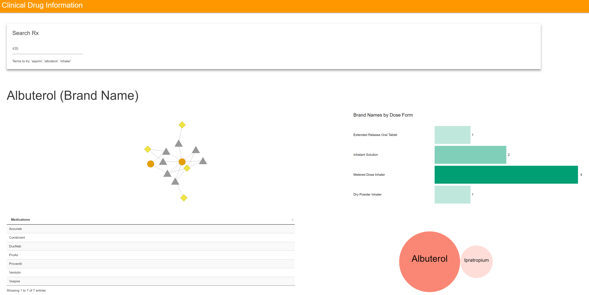

Clinical Drugs 
---------------------

RxNorm was created by the U.S. National Library of Medicine (NLM) to provide a normalized naming system for clinical drugs, defined as the combination of {ingredient + strength + dose form}.

Source: https://cloud.google.com/bigquery/public-data/rxnorm

For a sample view, run the Shiny app under the `local-search` folder.

